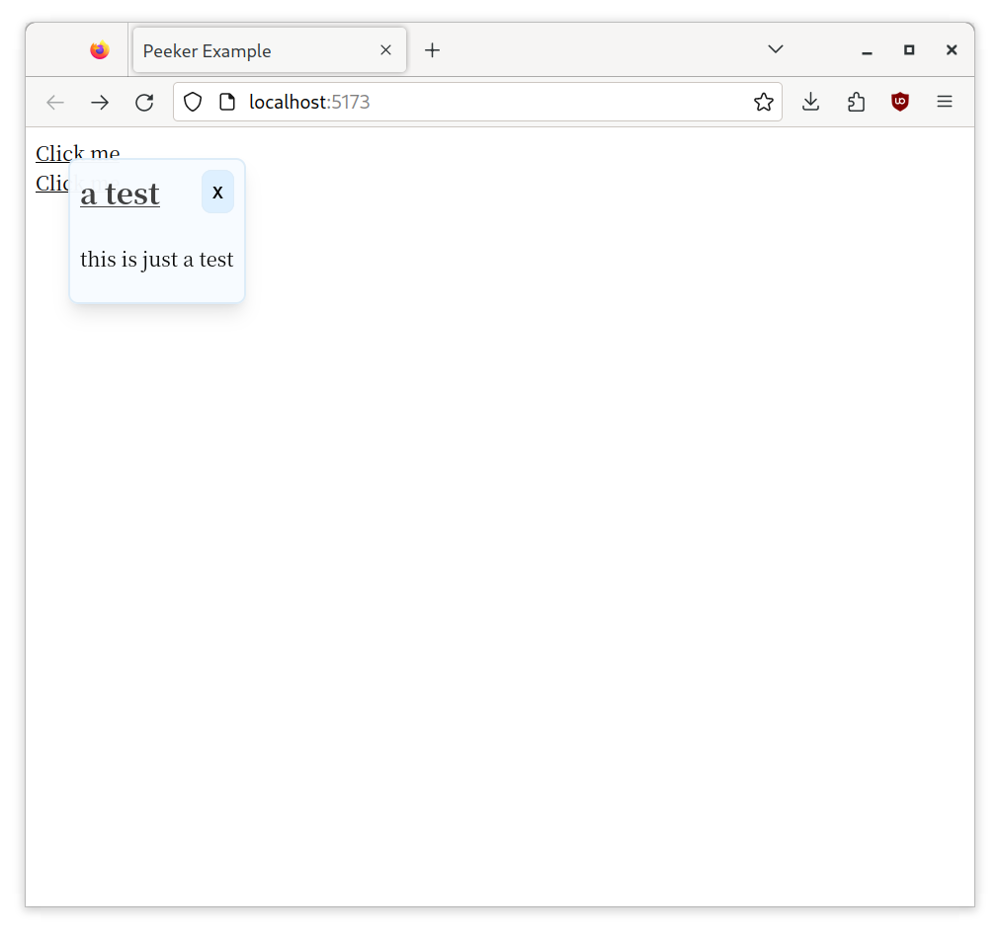

## What is Peeker?

**Peeker** is a web component that provides a preview window of your content.

Using **Peeker** as a web component, you:

- just have to prepare the previewing data

- don't pollute the thing not related to preview

- don't have to think about the framework stuff

- can keep your data with a open format when you want to stop using **Peeker**

**Peeker** is very useful in some static content site, like your blog.

## How to use Peeker

First, add this importing code to the head section of html:

```html
<script
  type="module"
  src="https://cdn.jsdelivr.net/gh/tkngaejcpi/peeker@0f70505c3f4ee5c967152bbd7fbad04edc54aa39/peeker.min.js"
></script>
```

Then, prepare a preview data json, with the schema:

> Note that "rawData" will be **unsafely** rendered to HTML, you should check them before using. _It is suggested to use a generator rather than writing the json file manually._

```json
{
  "title": "a test",
  "linkTo": "/test.json",
  "rawData": "<article><p>this is just a test</p></article>"
}
```

Finally, add

```html
<vvv-peeker></vvv-peeker>
```

to the body of html, and put

```html
<vvv-peekable data-url="$$PATH_OF_THE_JSON$$">Click me</vvv-peekable>
```

to the anywhere you want in the body, it will be rendered to `<a>` tag.

## Screenshots

Just a `vvv-peekable`, before click the link:


After click the link, the preview window pop up:



## TODO

- improve looking

- support external styling

- add cache

- ~~make the preview window next to the link~~

- ~~add animation~~
